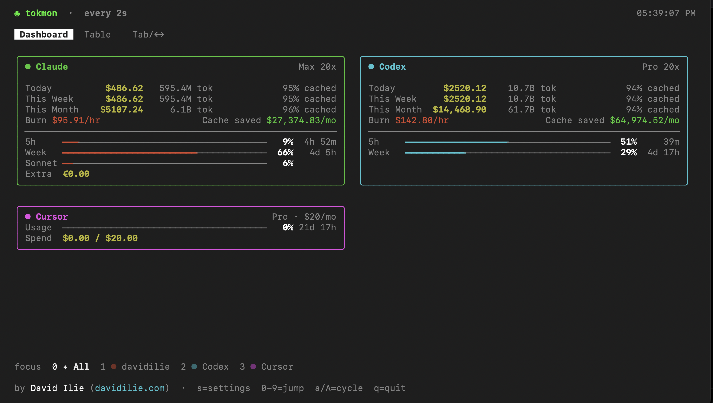

# tokmon

Terminal dashboard for Claude Code usage, costs, and rate limits.

Built with [Ink](https://github.com/vadimdemedes/ink), TypeScript.



## Quick Start

```bash
npx tokmon
```

Or with pnpm:

```bash
pnpm dlx tokmon
```

### Global Install

```bash
npm install -g tokmon
```

Then just run `tokmon`. Press `q` to quit.

## Options

```
-i, --interval <seconds>  Refresh interval in seconds (default: 2)
-h, --help                Show help
```

## Keybindings

### Global

| Key | Action |
|-----|--------|
| `Tab` | Cycle between Dashboard and Table |
| `1` `2` | Jump to Dashboard / Table |
| `s` | Open settings |
| `q` | Quit |

### Table View

| Key | Action |
|-----|--------|
| `d` `w` `m` | Switch to Daily / Weekly / Monthly |
| `←` `→` | Cycle sub-view |
| `↑` `↓` | Move cursor / navigate rows |
| `Enter` | Expand row — per-model cost breakdown |
| `Esc` | Collapse expanded row |
| `o` | Cycle sort: date ↑, date ↓, cost ↑, cost ↓ |
| `g` | Jump to top |
| `G` | Jump to bottom |
| `PgUp` `PgDn` | Page scroll |

### Settings

| Key | Action |
|-----|--------|
| `↑` `↓` | Select option |
| `←` `→` | Adjust value |
| `s` / `Esc` | Close |

## Views

### Dashboard

- **Today / This Week / This Month** — cost and token summaries
- **Burn rate** — current $/hr
- **Rate Limits** — real-time session (5h), weekly (7d), and Sonnet utilization with reset countdowns, fetched from Anthropic's OAuth API

### Table

Interactive table with 3 sub-views:

- **Daily** — per-day breakdown (6 months of history)
- **Weekly** — grouped by ISO week
- **Monthly** — grouped by month

Each row shows models used, input/output/cache tokens, and cost. Press `Enter` on any row to expand a per-model breakdown:

```
▸ Apr  7  haiku-4-5, op~  7.6K 487.0K  10.1M    1.1B  $603.89
          ├─ opus-4-6          7.5K    485.0K    10.0M      1.1B  $601.50
          └─ haiku-4-5          100     2.0K     100K      5.0M    $2.39
```

Sort by date or cost with `o`.

## Settings

Press `s` to open. Persisted to `~/.config/tokmon/config.json` (macOS/Linux) or `%APPDATA%\tokmon\config.json` (Windows).

- **Refresh interval** — dashboard poll rate (default: 2s)
- **Billing poll** — rate limits API poll rate (default: 5m, min 1m to avoid 429s)
- **Clear screen** — clears terminal on launch (like `watch`)

## How It Works

- Reads Claude Code's JSONL session logs from `~/.claude/projects/`
- Calculates costs using Claude model pricing (Opus, Sonnet, Haiku)
- Caches file reads by mtime — subsequent refreshes are near-instant
- Dashboard loads current month only (fast). Table loads 6 months lazily.
- Rate limits fetched from Anthropic OAuth API every 2 minutes (token from macOS Keychain)

Cross-platform: macOS, Linux, Windows.

## CI/CD

Publishes to npm and GitHub Packages via GitHub Actions on version tags:

```bash
git tag v0.7.0 && git push --tags
```

## Requirements

- Node.js 20+
- [Claude Code](https://docs.anthropic.com/en/docs/claude-code)

## Author

By [David Ilie](https://davidilie.com)

## License

[MIT](LICENSE)
