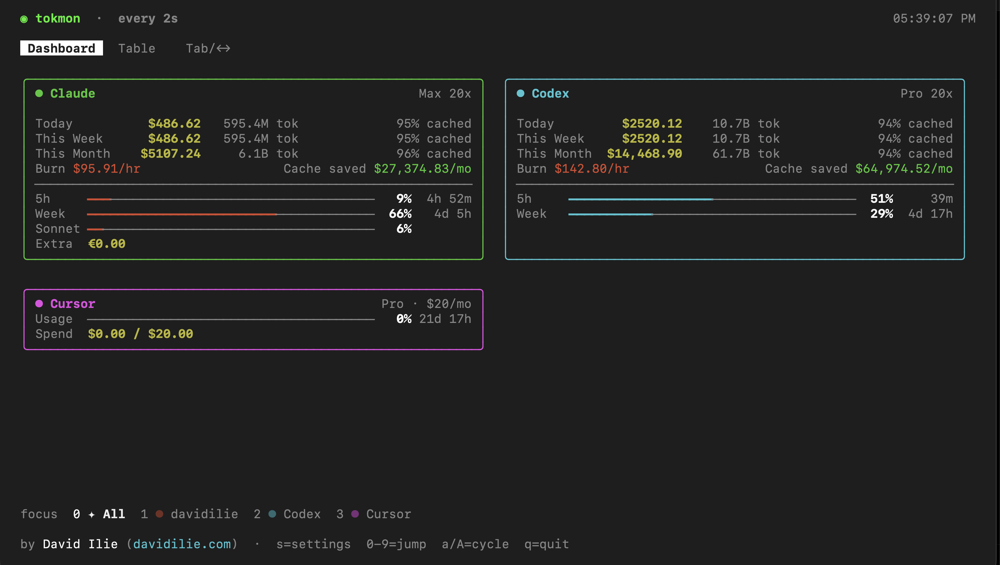
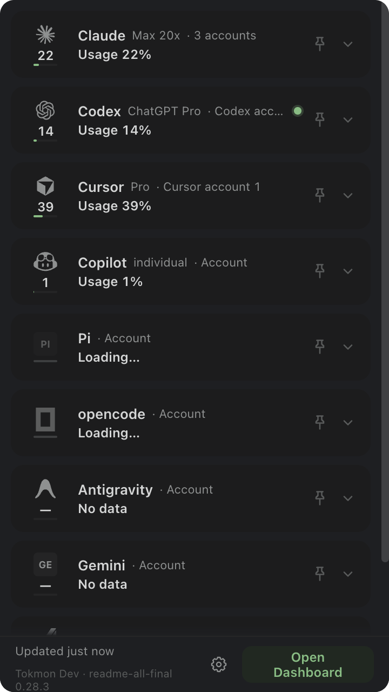
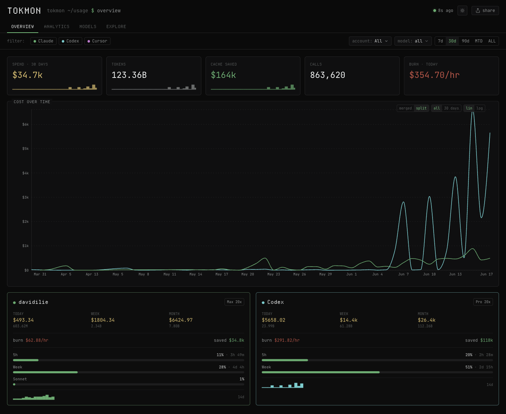
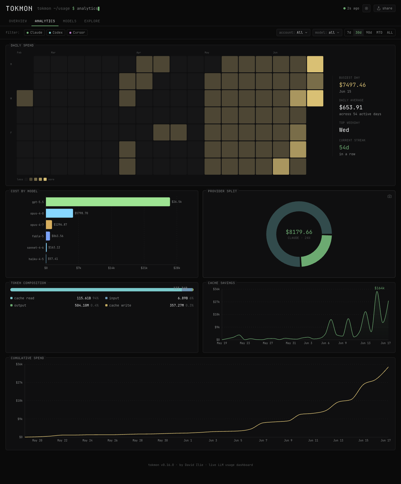
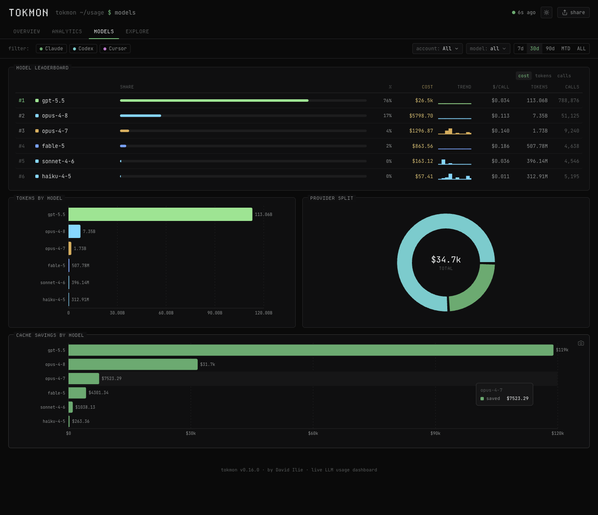
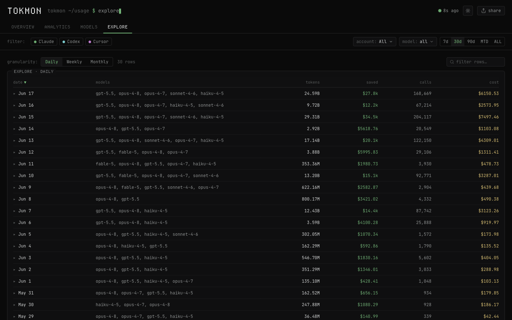

# tokmon

Terminal dashboard for **Claude Code**, **Codex**, **Cursor**, **Copilot**, **opencode**, **pi**, **Antigravity**, **Gemini**, and **Grok** — usage, costs, and rate limits, all in one place.

Built with [Ink](https://github.com/vadimdemedes/ink) and TypeScript.



## Desktop menu bar app

Tokmon Desktop keeps the most useful quota signal visible without opening a terminal. It runs as a menu-bar app on macOS and a notification-area tray app on Windows and Linux.



- Pins up to two choices—such as Claude and Codex—as one adjacent macOS menu-bar strip. Windows and Linux use a status-aware tray icon and tooltip.
- Shows every detected provider and account in a scrollable provider-grouped popover; provider names and marks are always explicit.
- Keeps pins stable while independently marking every account that is active. Activity never reorders providers or silently replaces a pin.
- Uses an explicit provider mark with its usage score plus calm continuous meters, exact reset copy, and visible High / Very high states.
- Keeps the popover focused on quota status, refresh, and Open Dashboard. Compact Theme and Desktop App pages cover everyday preferences; custom palette editing, analytics, and advanced controls stay in the web dashboard.
- Shares one daemon-owned appearance across desktop, web, and TUI: Tokmon, Phosphor, the complete ZeroCut editor-theme catalog, OS-following Auto mode, and contrast-checked custom palettes derived from any preset.
- Reuses the same local daemon as the CLI and web dashboard. Whichever client starts first owns it; compatible clients attach instead of duplicating provider polling.

Download signed macOS and Windows installers, or AppImage / Debian packages for Linux, from [GitHub Releases](https://github.com/DavidIlie/tokmon/releases). Windows exposes Tokmon in the standard notification area; Windows does not provide a supported API for third-party apps to occupy the Copilot or Control Center surface.

The tray interaction was researched against [OpenUsage by Robin Ebers](https://github.com/robinebers/openusage), [CodexBar by Peter Steinberger](https://github.com/steipete/CodexBar), and [ccusage](https://github.com/ryoppippi/ccusage). Provider vector marks and compact reset formatting adapted from OpenUsage are used under its MIT license; see [THIRD_PARTY_NOTICES.md](THIRD_PARTY_NOTICES.md). Tokmon's daemon, contracts, tray composition, and application implementation remain its own.

For development:

```bash
pnpm install
pnpm --prefix web install
pnpm run build
pnpm run dev:desktop
```

Development and release use separate daemon channels. Normal installs and the published CLI share `~/Library/Caches/tokmon/daemon.json` (or the platform equivalent); every `pnpm dev*` command uses the tagged `dev` channel at `~/Library/Caches/tokmon/dev/daemon.json`. This means the local Electron app and `pnpm dev` attach to one development daemon without disturbing an installed Tokmon or a release CLI session.

To exercise the installed bundle with the development daemon—matching the desktop/runtime workflow used by T3Code—install Tokmon first, then run:

```bash
pnpm run dev:installed
# in another terminal: pnpm run dev
```

The installed app owns or attaches to the `dev` daemon and the TUI reuses that exact owner. Set `TOKMON_DESKTOP_APP_PATH` when the app is installed somewhere other than the platform default.

Desktop release artifacts are built by `.github/workflows/desktop-release.yml`. Tagged releases require `MAC_CSC_LINK`, `MAC_CSC_KEY_PASSWORD`, `APPLE_ID`, `APPLE_APP_SPECIFIC_PASSWORD`, `APPLE_TEAM_ID`, `WIN_CSC_LINK`, and `WIN_CSC_KEY_PASSWORD`; missing signing credentials fail the release instead of silently publishing unsigned desktop binaries.

Installed release builds check GitHub Releases shortly after launch and every hour while Tokmon remains open. A discovered update downloads in the background, appears as a **Restart** action in the popover when ready, and is also installed during the next clean quit. **Check for Updates** is available from the tray context menu. Development builds never contact the release feed.

The release workflow publishes the platform installers together with `latest-mac.yml`, `latest.yml`, `latest-linux.yml`, and differential-update blockmaps. It verifies every metadata size and SHA-512 against the final artifact bytes, checks Developer ID signatures and notarization on macOS, checks Authenticode on Windows, and re-verifies the merged payload before creating the GitHub Release. npm and GitHub Packages publish only after that release succeeds, preventing a tag from publishing packages while desktop signing fails. A manual workflow run accepts an existing tag so an incomplete release can be rebuilt and repaired without bypassing those checks; it deliberately does not republish packages. The tag, root package version, and desktop package version must match exactly.

## Quick Start

```bash
npx tokmon
```

Or with pnpm:

```bash
pnpm dlx tokmon
```

### Global Install

```bash
npm install -g tokmon
```

Then run `tokmon`. On first launch you'll pick which providers to track; press `q` to quit any time.

## CLI Data Queries

Scripts and coding agents can query the same daemon directly without opening the interactive dashboard:

```bash
tokmon usage                              # current-month usage by provider/account/model
tokmon usage --period week --provider codex
tokmon usage --model opus --json          # stable machine-readable schema
tokmon usage --period all --json --compact
tokmon providers --json                   # accounts plus local config/auth/usage paths
tokmon snapshot --refresh                 # complete raw daemon snapshot
tokmon config path                        # tokmon config file location
```

`usage` refreshes local history by default; use `--cached` for the fastest cached answer or `--refresh` to refresh billing as well. JSON reports include `schemaVersion`, exact provider/account source IDs, per-model token and cost fields, and a `sources` collection that maps every model row to its provider home and discovered local paths. Run `tokmon usage --help` or `tokmon providers --help` for every filter and example.

## Providers

**Usage providers** — full cost & token history (Today / Week / Month, sparkline, per-model table):

| Provider | What it reads | What you get |
|----------|---------------|--------------|
| **Claude** | `~/.claude/projects/**/*.jsonl` | Cost & token history, plan (e.g. Max 20x), live 5h / weekly / Sonnet limits |
| **Codex** | `~/.codex/sessions/**/rollout-*.jsonl` | Cost & token history, plan, live 5h / weekly limits, credit balance |
| **Cursor** | Cursor API usage events + local `composerData` | Cost & token history (Today / Week / Month), plan, period spend, on-demand caps |
| **opencode** | `~/.local/share/opencode/opencode.db` | Cost & token history across whatever providers opencode routes to (uses its own recorded cost) |
| **pi** | `~/.pi/agent/sessions/**/*.jsonl` | Cost & token history (uses pi's own recorded cost) |
| **Grok** | `~/.grok/logs/unified.jsonl` (+ session model join) | Cost & token history from Grok CLI turns, SuperGrok / credits billing when signed in |

**Billing / quota providers** — plan + live quota or spend (no local token history):

| Provider | What it reads | What you get |
|----------|---------------|--------------|
| **Copilot** | GitHub token (gh / VS Code) | Plan + premium-request & chat quota |
| **Antigravity** | its `state.vscdb` OAuth → Google Cloud Code | Plan + per-pool (Gemini Pro/Flash/Claude) quota |
| **Gemini** | `~/.gemini/oauth_creds.json` → Google Cloud Code | Plan + quota (re-run `gemini` to refresh an expired token) |

tokmon auto-detects which tools are installed (on `PATH` or as a desktop app). On first launch you pick which to track, and when a new provider you have installed is added in an update, tokmon offers it once on the next launch. You can also toggle any provider in settings.

Costs use each model's published pricing (or the tool's own recorded cost where it stores one). **Cached tokens are billed at the discounted cache-read rate**, not full input rate — so tokmon's totals reflect what you're actually charged, and tend to be far lower than tools that count cache reads at full price.

## Views

### Dashboard

A responsive grid of provider cards (or one card at a time — see **Dashboard layout** in settings). Each card shows:

- **Today / This Week / This Month** — cost and token summaries
- **Burn rate** — current $/hr
- **Cache saved** — what caching has saved you
- **Rate limits** — live utilization bars with reset countdowns or exact reset dates
- **Sparkline** — recent daily activity

The grid reflows to fit your terminal — more columns when it's wide, compacting cards when it's short. With more providers than fit on screen, it splits into **pages**; **scroll** (mouse wheel) to move between them (or `↑`/`↓` / `[` `]`). When you track more than one account, a focus strip lets you view **All** together or zoom into a single account.

A **Peak / Off-Peak** badge appears in the header (Claude only), fetched from [promoclock.co](https://promoclock.co) — peak hours drain session limits faster.

### Table

Per-provider history with a provider selector (`p` / `P`), search (`/`), and sorting (`o`).

For **Claude / Codex / Cursor / Grok** — Daily, Weekly, and Monthly breakdowns across all available local history. Each row shows models used, input/output/cache tokens, and cost. Press `Enter` to expand a per-model breakdown:

```
▸ Apr  7  haiku-4-5, op~  7.6K 487.0K  10.1M    1.1B  $603.89
          ├─ opus-4-6          7.5K    485.0K    10.0M      1.1B  $601.50
          └─ haiku-4-5          100     2.0K     100K      5.0M    $2.39
```

## Web Dashboard

Prefer a browser? `tokmon serve` starts a local web dashboard with the same data as the TUI — charts, global filtering, and shareable images — in a terminal-styled UI. Press `w` (or `W`) inside the TUI to open its ordinary local URL.

```bash
tokmon serve            # opens http://127.0.0.1:4317 in your browser
tokmon serve --port 8080
tokmon serve --no-open  # don't auto-open the browser
```

It binds to `127.0.0.1` by default and reads the same local daemon state. The browser connects directly over a same-origin WebSocket; dashboard URLs have no token or login step. Optional LAN access can be enabled in settings, with an explicit unsafe-access warning, and takes effect after the daemon restarts. When publishing the dashboard through an ingress or reverse proxy, add each exact DNS name to **Allowed hosts** in settings (for example, `tokmon.example.com`); IP hosts remain allowed in LAN mode. The dashboard renders instantly from a cached snapshot, then streams live updates and goes idle when no tab is open. Press `R` or use the visible **Refresh** control to update it. Filter by provider, model, account, and period (`7d`, `30d`, `90d`, `MTD`, `6M`, or `All`), choose Auto / light / dark appearance, and export any panel — or a summary card — as a PNG with the **Share** button. Exports resolve the same selected palette as the visible dashboard.

### Overview

KPIs with inline sparklines, provider cards with live rate-limit bars, and a cost-over-time chart that spans your full history by default. Toggle **merged** (one combined total) vs **split** (a line per provider), **all-time** vs the selected period, and linear vs log.



### Analytics

A full-width, all-time daily-spend calendar — hover any day for a per-model spend breakdown — with at-a-glance stats (busiest day, daily average, top weekday, current streak), alongside cost-by-model, an interactive provider split, token composition, cache savings, and cumulative spend.



### Models

A leaderboard sortable by cost / tokens / calls, each row showing a per-model trend sparkline, cost-per-call, tokens, and calls — over tokens-by-model and cache-savings-by-model charts.



### Explore

The full daily / weekly / monthly table — searchable, sortable on every column, with expandable per-model breakdowns.



The dashboard is a prebuilt static bundle shipped in the package — no build step, fully offline.

## Keybindings

### Global

| Key | Action |
|-----|--------|
| `Tab` | Switch between Dashboard and Table |
| `←` `→` | (Dashboard) switch between Dashboard and Table |
| scroll / `↑` `↓` / `[` `]` | (Dashboard) move between pages when paginated |
| `a` `A` | Cycle account focus forward / back |
| `0`–`9` | Jump to an account focus slot |
| `r` / `R` | Refresh all usage, billing, peak, and history data |
| `p` | Toggle privacy mode (configurable in settings) |
| `w` `W` | Toggle the web dashboard (opens in your browser) |
| `s` | Open settings |
| `q` | Quit |

### Table

| Key | Action |
|-----|--------|
| `P` | Cycle provider back |
| `/` | Search (Esc clears) |
| `o` | Cycle sort |
| `d` `w` `m` | Daily / Weekly / Monthly *(Claude/Codex)* |
| `←` `→` | Cycle period *(Claude/Codex)* |
| `Enter` | Expand row — per-model breakdown *(Claude/Codex)* |
| `↑` `↓` | Move cursor |
| `g` `G` | Jump to top / bottom |
| `PgUp` `PgDn` | Page scroll |
| `Esc` | Clear search, then collapse row |

### Settings

| Key | Action |
|-----|--------|
| `↑` `↓` | Select row |
| `←` `→` | Adjust value / toggle |
| `Enter` | Edit / confirm |
| `Space` | Toggle provider · set account active |
| `Shift`+`↑` `↓` | Reorder accounts |
| `d` `x` | Delete account |
| `s` / `Esc` | Close |

## Settings

Press `s` to open.

**General**

- **Refresh interval** — dashboard poll rate (default: 2s)
- **Billing poll** — rate-limit / spend API poll rate (default: 5m, min 1m to avoid rate limiting)
- **Clear screen** — clears the terminal on launch (like `watch`)
- **Privacy mode** — hides email addresses by default
- **Privacy key** — one-key dashboard toggle for privacy mode (default: `p`)
- **Timezone** — IANA timezone, or `System`
- **Dashboard layout** — `grid` (all providers at once) or `single` (one at a time)
- **Default focus** — start on `all`, or remember your `last` focused account
- **ASCII glyphs** — `auto` (detect), `on` (force ASCII), or `off` (force Unicode)
- **Network access** — loopback-only by default; optional LAN access is explicitly marked unsafe
- **Reset times** — show time remaining or the exact reset date/time in the configured timezone

**Theme**

- **Tokmon** — the original Tokmon dark palette plus its accessible light counterpart; this remains the default
- **Phosphor** — an intentionally dark-only black terminal palette with green data ink and a gold cost signal
- **Editor catalog** — paired light/dark VS Code, Monokai, Dracula, GitHub, Nord, One Dark Pro, Solarized, Tokyo Night, Catppuccin, Midnight, Forest, Sunset, Cyberpunk, Synthwave, Luxury, and Minimal palettes imported from ZeroCut's common theme format
- **Custom** — derive from any built-in preset, then edit its paired light and dark colors in the web dashboard with strict `#RRGGBB` input and contrast validation
- **Appearance** — Auto follows the operating system in the web and desktop apps; explicit Light and Dark override it
- **Terminal colors** — preserve the classic ANSI TUI, opt into palette-derived dark/light ink, or disable decorative color; Tokmon never paints the terminal background and honors `NO_COLOR`

Appearance is stored atomically by the daemon, so a change made in any client propagates to the others. Browser storage is only a validated first-paint cache; it is never the settings authority.

**Desktop App**

- Choose the menu-bar summary, pin up to two provider values, control provider disclosure, and configure launch at login
- The compact desktop Theme page previews and selects the entire catalog; **Customize in Dashboard** opens the full paired-palette editor using the selected preset as its starting point

**Providers** — toggle each provider on or off.

**Accounts** — add, edit, reorder, and delete accounts. Each account has a provider, a name, a home directory (so you can track multiple logins across different `HOME`s), and an accent color. Multiple accounts per provider are supported.

## Options

```
tokmon [options]            Launch the terminal dashboard
tokmon serve [options]      Launch the web dashboard (http://127.0.0.1:4317)
tokmon usage [options]      Query usage by model (human or JSON)
tokmon providers [options]  Show accounts and local provider paths
tokmon snapshot [options]   Print the raw daemon snapshot as JSON
tokmon config [path]        Print the tokmon config file location

Options:
-i, --interval <seconds>  Refresh interval in seconds (default: from config, or 2)
    --ascii               Force ASCII glyphs (also: TOKMON_ASCII=1)
    --no-ascii            Force Unicode glyphs
-h, --help                Show help

serve options:
-p, --port <n>            Port to listen on (default: 4317, auto-falls back if taken)
    --no-open             Don't open the browser automatically
```

tokmon auto-detects whether your terminal can render Unicode (block sparklines, box borders) and falls back to ASCII on terminals/fonts that can't (e.g. legacy Windows console). Override with `--ascii` / `--no-ascii`, the `TOKMON_ASCII` env var, or the **ASCII glyphs** setting.

## Files

| Path | Purpose |
|------|---------|
| `~/.config/tokmon/config.json` (macOS/Linux) | Settings |
| `%APPDATA%\tokmon\config.json` (Windows) | Settings |
| `~/Library/Caches/tokmon` (macOS) | Parse cache |
| `~/.cache/tokmon` (Linux, or `$XDG_CACHE_HOME`) | Parse cache |
| `%LOCALAPPDATA%\tokmon\cache` (Windows) | Parse cache |

Config writes are atomic (temp + rename) so a crash mid-save can't corrupt the file.

## Privacy

By default, tokmon runs locally and reads provider data **read-only**:

- It never writes to any provider's data — SQLite databases (Cursor, opencode) are opened strictly read-only.
- Credentials are read only to call each provider's **own official API** (Anthropic, ChatGPT backend, Cursor, GitHub, Google Cloud Code) for *your own* usage. Tokens are never logged, displayed, or sent anywhere else.
- In local mode, outbound requests go to those provider APIs and the optional peak-pricing clock.

## How It Works

tokmon runs a small local **daemon** that does all the data collection. The terminal UI and the web dashboard are both thin clients of it, talking over a local WebSocket — loopback-only by default — so a single process does the work and the TUI and web always show the same numbers. The daemon starts automatically with the TUI (and standalone via `tokmon serve`), and idle-pauses when nothing is watching.

**Usage & cost**
- Parses each tool's local session logs — Claude / Codex / pi `JSONL`, Cursor / opencode `SQLite` — and aggregates cost and token usage per day, week, and month.
- Cost is an API-equivalent estimate from each model's published pricing, counting cached input at the discounted cache-read rate (not the full input rate, not free).
- A persistent parse cache keyed by file **mtime + size** makes repeat launches near-instant; edited or deleted files are re-read automatically.

**Accounts**
- Each enabled provider is detected automatically, and its real account identity — email and plan — is read from local auth (e.g. Claude `~/.claude.json`, the Codex `id_token`, Cursor's state DB). Extra accounts, like additional Claude homes, are auto-discovered too.

**Limits & billing**
- Rate limits and remaining spend/quota come from each provider's own official API. Tokmon refreshes them on the configured billing interval; terminal focus and extra dashboard viewers reuse fresh data instead of issuing extra provider requests.

**Responsiveness**
- Dashboard summaries and table history load independently and refresh on separate intervals, so the UI stays responsive even on large histories.
- The TUI shows the usage and limits cadences separately and reconnects automatically if a suspended terminal leaves its live stream stale.

Cross-platform: macOS, Linux, Windows. By default, collection is local and provider data stays read-only — see [Privacy](#privacy).

## Requirements

- Node.js 20+ (**24+ recommended**)
- The CLIs/apps you want to track
- **SQLite** for the Cursor / opencode readers: on Node 24+ this uses the built-in `node:sqlite` — **nothing to install**. On Node 20–23 it falls back to the system `sqlite3` CLI (preinstalled on macOS; `apt install sqlite3` / `winget install sqlite` elsewhere).

## Marketing site

The public website is a standalone Astro project in `site/`. It is kept outside
the CLI and desktop workspaces so publishing the npm package or bundling the
Electron app never includes website dependencies.

```bash
pnpm --prefix site install
pnpm run dev:site
pnpm run check:site
pnpm run build:site
```

The generated site is deployment-agnostic; `site/vercel.json` supports a
separate Vercel project rooted at `site/` when a deployment is configured.

## CI/CD

Publishes to npm and GitHub Packages via GitHub Actions on version tags:

```bash
git tag v0.14.0 && git push --tags
```

## Author

By [David Ilie](https://davidilie.com)

## License

[MIT](LICENSE)
